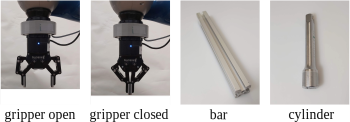
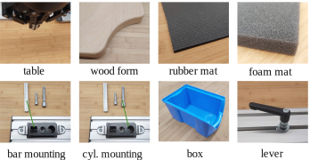

# KROCO Dataset

KROCO is an acronym for **K**inesthetic **Ro**bot **Co**ntacts. The dataset consists of Learning from Demonstration (LfD, aka Programming by Demonstration (PbD)) samples. This repository contains dataset files in the hdf5 format.

## Read Dataset

### Python

There is code in the folder `python` to load the dataset. Adapt the variable TODO to the destination of the dataset.

`python load_data.py`

### MathWork's Matlab

An example to display the whole dataset and read the first segment:

```
h5disp('DATASET_PATH', '/')
dataset0 = h5read('DATASET_PATH', '/data/0')
```

For more details, please check this [guide](https://de.mathworks.com/help/matlab/ref/h5read.html).

## Dataset Description

### Tools



### Environments




### Structure

The hierarchical dataset is structured as follows:

```
.
+ data # a group containing all datasets
  + 0 # a dataset for one interaction
    + attrs: label, label_string, tool, environment, hash,
  + 1
  + ...
+ labels # a label vector for all classes
  
```

### Labels

| Class ID | Name            |
| -------- | --------------- |
| 0        | touch           |
| 1        | press           |
| 2        | press and slide |
| 3        | contour         |
| 4        | insert          |
| 5        | hand-over       |
| 6        | turn            |
| 7        | push            |

### Dimensions

Each dataset is in the form of (*N* x *D*) with *N* samples and *D=15* dimensions. *N* differs between datasets depending on the duration of the interaction.
The following table shows the 0-indexed data columns and the unit in brackets [].

| Data column | Description                                                  |
| ----------- | ------------------------------------------------------------ |
| 0..2        | position x,y,z in [*m*]                                      |
| 3..6        | orientation quaternions in scalar-last (x,y,z,w) format      |
| 7..12       | wrench in origin frame (f_x, f_y, f_z, m_x, m_y, m_z)  [*N*, *Nm]* |
| 13          | gripper finger distance from 0..1, 0: fully open, 1: fully closed |
| 14          | grasp status (-1: no object in gripper, 0: gripper moving, 1: object in gripper) |

### Sample Rate

 The sample rate is 50 *Hz*.
